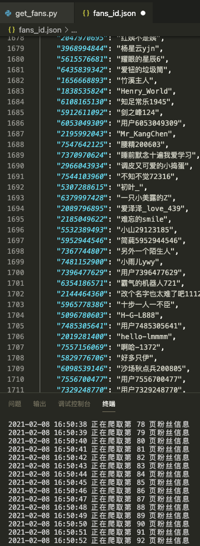

# 简易微博爬虫-UESTC软院大二课程设计
### 功能:
1. 爬取微博某账号的粉丝信息
2. 爬取微博某条评论下的内容 

### 思路与成果展示:
1. (以UESTC官方微博为例)
* 先通过爬取大v的粉丝列表，获得每个粉丝的id与名称将其存入fans_id.json

将fans_id.json拆分成几个小文件后,启动多线程通过每个文件中粉丝id去爬取粉丝主页,并将最终的数据存取到数据库中