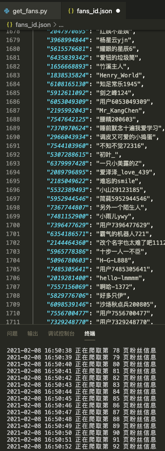
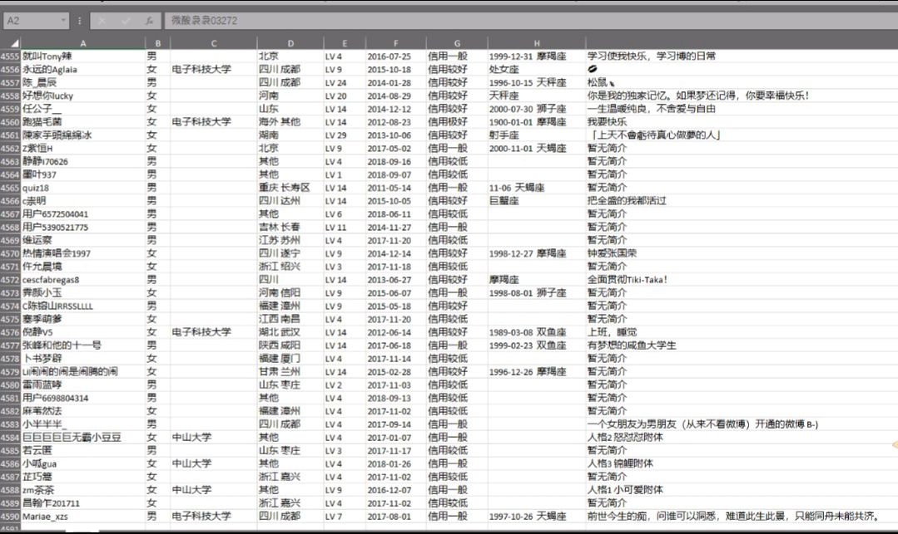
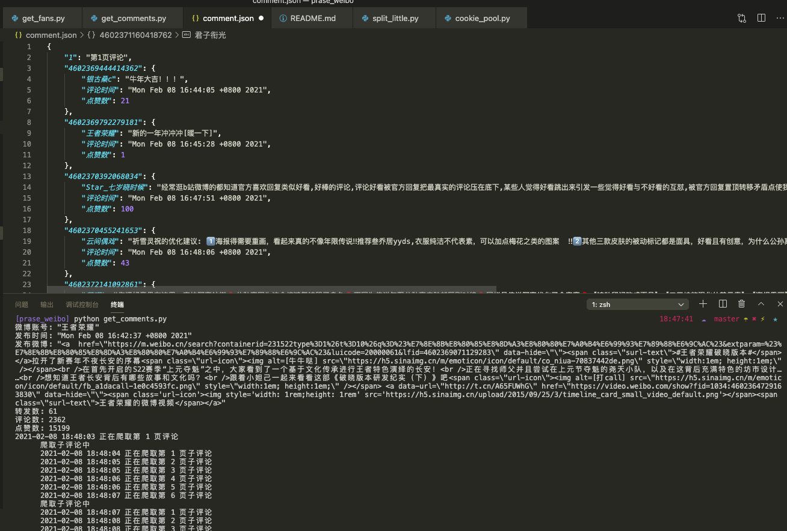

# 简易微博爬虫-UESTC软院大二课程设计
本软件仅供学习交流，如作他用所承受的法律责任一概与作者无关（下载使用即代表你同意上述观点）
### 功能:
1. 爬取微博某账号的粉丝信息
2. 爬取微博某条评论下的内容 

### 思路与成果展示:
1. (以UESTC官方微博为例)
* 先通过爬取大v的粉丝列表，获得每个粉丝的id与名称将其存入fans_id.json
  
* 将fans_id.json拆分成几个小文件后,启动多线程通过每个文件中粉丝id去爬取粉丝主页,并将最终的数据存取到MonogoDB数据库中, 再导出为excel如下:

2. 爬取某条微博下的评论,评论还有子评论，为两级结构
使用[王者荣耀牛年新赛季](https://m.weibo.cn/status/4602369071129283)微博作为样例测试

2021.1更新:
ip池与cookie池均已失效